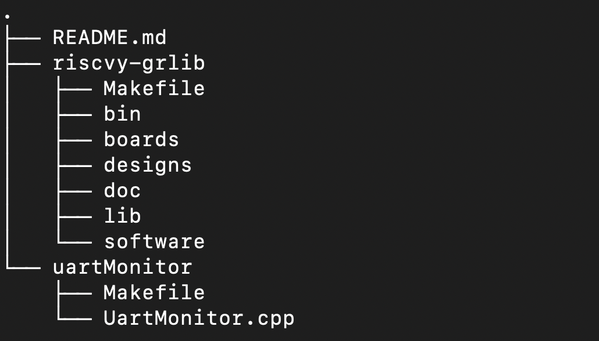
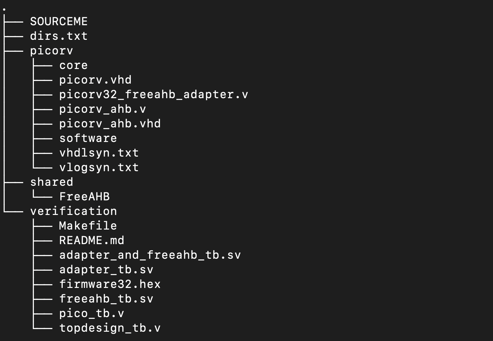
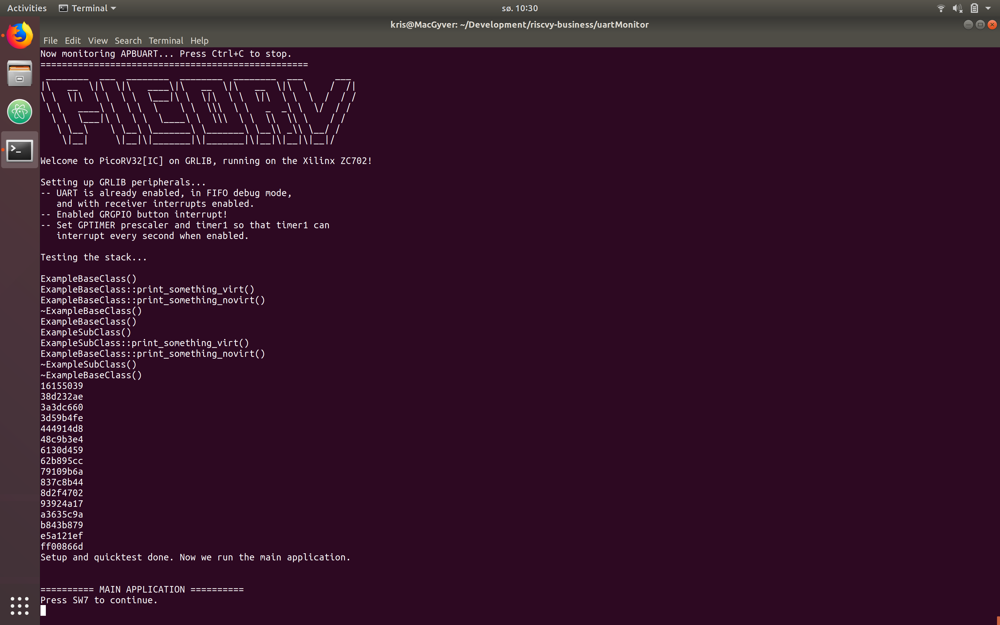

# RISCVy Business

***Master's project: Fusing together a RISC-V core and the GRLIB IP core library.***

We utilize Cobham Gaisler's [GRLIB IP Core library](https://www.gaisler.com/index.php/downloads/leongrlib), Clifford Wolf's [PicoRV RISCV-32I[M][C] processor](https://github.com/cliffordwolf/picorv32), and Revanth Kamaraj's [FreeAHB master](https://github.com/krevanth/FreeAHB), to form a sample RISC-V32 computing platform, running on a FPGA on the Xilinx ZC702 AP SoC.

We have also heavily depended on great open-source tools such as [Icarus Verilog](http://iverilog.icarus.com/) and [GtkWave](http://gtkwave.sourceforge.net/) for this project.

This README merely describes the structure and how to run the design. For the motivation and surrounding discussion, see the master thesis report (coming soon). *If you are not here for reproducing the results, chances are that the thesis contains more interesting information for hardware porting concerns and techniques.*

## Getting started
To get started, make sure that you are on a x86-64bit Ubuntu 18.04 LTS system with a recent version of ```git``` installed.
We have only tested the build and implementation via this OS, and cannot guarantee
that it works for other Linux flavors or other OSes.

Clone this repository, then initialize the submodules PicoRV and FreeAHB.
These submodules are forks we have done from the original repositories with little
changes, done to ensure availability.

```
git clone https://github.com/N35N0M/riscvy-business.git
cd riscvy-business
git submodule init
git submodule update 
```

## Repository layout



**riscvy-grlib** is a modified version of the Cobham Gaisler IP core library version 2018.3-b4226, available [here](https://www.gaisler.com/index.php/downloads/leongrlib). Per the GRLIB user manual (found [here](https://www.gaisler.com/index.php/downloads/leongrlib)): ```bin``` contains scripts and support files for tools, ```boards``` contain support files for various prototype boards, ```designs``` contain various template GRLIB designs, ```doc``` includes the documentation, ```lib``` contains the various IP cores available, and ```software``` contains utilities and TB.
Our main contributions within ```riscvy-grlib``` is contained in four places:

- ```riscvy-grlib/lib/riscv```: A new IP core library we have added, which contains firmware, hardware designs, and verification TBs for GRLIB-targetted RISC-V designs. See the next section for more details.
- ```riscvy-grlib/designs/leon3-xilinx-zc702```: A modification of the out-of-the-box LEON3 GRLIB design for the Xilinx ZC702. Here, we have cut out the LEON3 processor and DSU, and replaced it with PicoRV and relevant wiring.
- ```riscvy-grlib/designs/leon3-xilinx-zc702-SIM```: A simulator version of a earlier version of the modified design, but does not include elements from the final design, as the activeHDL testbench it is based on depends on the LEON3 to be instantiated to function, and we have not had the time to make a full system testbench designed with something else than the LEON3 in mind.

**uartMonitor** contains a simple software monitor, which utilizes the Digilent Adept2 SDK, in order to communicate with our target ZC702 FPGA design. It instructs the Xilinx TAP on the chip's JTAG scan-chain to perform USER1 and USER2 instructions, which are connected to AHBJTAG on the GRLIB FPGA design, which takes these instructions and produces AHB bus accesses from them.

### The RISC-V Library
The RISC-V library has the following layout:


The ***SOURCEME*** must be sourced when running testbenches in verification. It will set environment variables which contains paths to various verilog modules that are utilizes in the testbenches.

***dirs.txt*** is a special file used by GRLIB Makefiles so it knowns where to look for riscv library files. 

***picorv*** contains all files that are strictly relevant for a PicoRV-based GRLIB design. It contains ```core```, which is a git submodule of a fork of the original PicoRV repository. ```picorv32_freeahb_adapter.v``` is a custom adapter which connects the PicoRV memory interface to the FreeAHB master UI interface. ```picorv_ahb.v``` is a toplevel design which instantiates PicoRV, the pico-to-freeahb adapter, and the FreeAHB master together. ```picorv_ahb.vhd``` is a language wrapper for the verilog version of the design. It also adds extra VHDL primitives which are used in the *GRLIB plug-and-play mechanism* that is added on top of the standard AMBA AHB specification. ```picorv.vhd``` creates a VHDL package out of the module, so that it can easily be instantiated in the architecture of other VHDL modules. 

```software``` contains the neccessary software for building a version of the firmware for the implementation version, and one for module testbenches and the ZC702 design testbench found in ```picorv/software/sim```. Many of the software files are derived variants of the software(s) found in the original PicoRV repository, which were released to the public domain.

Finally, ```vhdlsyn.txt``` and ```vlogsyn.txt``` are special files used by the GRLIB Makefiles to determine which files are used for VHDL synthesis and Verilog synthesis respectively.

***shared*** is intended to hold components that are natural to be shared between various RISC-V processors. It might seem a bit redundant when only picorv is in place, but the intention is that this library can be expanded to hold several cores. FreeAHB is then a natural component to share, as it can easily be adapted to suit the memory interfaces of other cores as well. ```FreeAHB``` is a submodule of a fork of the original FreeAHB master. Only minor changes has been done to the fork, and it is mostly done to ensure availability.

***verification*** contains testbenches used to test modules inside the library only (i.e. nothing that has to do with GRLIB designs). Run ```make help``` inside here in order to see what testbenches are available. Most of them are only slightly derived from the originals found in the PicoRV and FreeAHB source repositories.

## Installation on x86 64-bit Ubuntu 18.04 LTS
### Required apt packages

Install the following via apt:

```
# Packages required by PicoRV as listed in its README:
sudo apt-get install autoconf automake autotools-dev curl libmpc-dev \
        libmpfr-dev libgmp-dev gawk build-essential bison flex texinfo \
    gperf libtool patchutils bc zlib1g-dev git libexpat1-dev

# Icarus Verilog for simulation, GtkWave for viewing the wavedumps it produces
sudo apt-get install iverilog gtkwave

```

### Building the RISC-V toolchain
We utilize the handy Makefile that is included in the PicoRV submodule. It is already
described in its README, but we reproduce this table here:

| Command                                  | Install Directory  | ISA       |
|:---------------------------------------- |:------------------ |:--------  |
| `make -j$(nproc) build-riscv32i-tools`   | `/opt/riscv32i/`   | `RV32I`   |
| `make -j$(nproc) build-riscv32ic-tools`  | `/opt/riscv32ic/`  | `RV32IC`  |
| `make -j$(nproc) build-riscv32im-tools`  | `/opt/riscv32im/`  | `RV32IM`  |
| `make -j$(nproc) build-riscv32imc-tools` | `/opt/riscv32imc/` | `RV32IMC` |

Run one of these commands in the PicoRV source directory, ```riscvy-business/riscvy-grlib/lib/riscv/picorv/core```,use run ```make -j$(nproc) build-tools``` to build all of them.
Note that building these usually takes a good hour or two to build on a laptop. The best would be to only build the RV32IC version, 
as that is the one we are using. Feel free to install any others if you wish to experiment, but note that this requires modifying the hardware design (Pico parameters) slightly.

### Licenced software installations
You will also need to manually install these applications:

- [Xilinx Vivado 2013.4: WebPACK Edition !!!WITH THE SDK!!!](https://www.xilinx.com/support/download/index.html/content/xilinx/en/downloadNav/vivado-design-tools/archive.html)
- [Digilent Adept2 Runtime, SDK, and utilities (64-bit Linux Zip)](https://reference.digilentinc.com/reference/software/adept/start?redirect=1#software_downloads)
- [GRMON3 Evaluation Version](https://www.gaisler.com/index.php/downloads/debug-tools)

#### Xilinx Vivado
After creating a user and downloading via the link above, you should have a tar-file in your ```~/Downloads``` folder.
Untar with ```tar -xvf Xilinx_Vivado_SDK_2013.4_1210_1.tar".
In the untared folder, you should see a ``xconfig`` file. Make it executable with ```chmod +x xconfig```, then run it with ```./xconfig```.

You will now be presented with the installation menu. Just keep the standard options and follow the installer until the installation starts. When prompted for a install folder, you can use which ever folder you want. We used ```/opt/Xilinx```, but that requires that the folder exists there, and that your user has ownership permissions of that folder (```chown USERNAME INSTALLFOLDER```).

When prompted, you should provide the WebPACK edition licence to the Xilinx Licence Manager (used in old versions of Vivado, such as 2013.4), which can be acquired through the [Xilinx Licencing Solution Center](https://www.xilinx.com/support/licensing_solution_center.html).

After everything is installed, we need to add Vivado to our user's path.
In ```~/.bashrc```, add the following line: ```source /opt/Xilinx/Vivado/2013.4/settings64.sh```.
If you used a different install path than ```/opt/Xilinx```, you will need to specify the correct path.

That's all for Vivado. We only use the CLI. We have found the GUI to be unstable, but the solution might be as simple as to have the correct, older java runtime installed. Finding the system requirements for Vivado 2013.4 would be a first step.

#### Digilent Adept2 SDK, runtime, and utilities

After having downloaded all three from Digilent, go ahead and unpack each of them with ```tar -xzf FOLDERNAMEHERE```. Then, go into each of them, make the install.sh executable with ```chmod +x install.sh```, then install with ```./install.sh```.

The SDK adds library files that are used in UartMonitor - our program which communicates with the design on the ZC702. The utilites add some utilities to your path which can be useful to detect if there are any JTAG debug links connected to your machine with ```djtgcfg```. Finally, the runtime includes the driver necessary to communicate with the ZC702 via the Digilent JTAG port.

#### GRMON
Extract the downloaded tar.gz with ```tar -xzf```. Then, move the untar'd folder to your desired install location.
We use /opt/grmon as our install location.

Then add the path to the GRMON library to the user path by adding the following to ```~/.bashrc```:
```PATH=$PATH:/opt/grmon/linux/bin64```


## Synthesizing and implementing the hardware
The toplevel design can be found in ```riscvy-business/riscvy-grlib/designs/leon3-xilinx-zc702/leon3mp.vhd```.
Most of the modules referenced here are provided by GRLIB and are found in ```riscvy-business/riscvy-grlib/lib```.
The PicoRV core, the FreeAHB master, and the design that connects them and wraps them from Verilog to VHDL is found in the ```riscv``` folder of ```lib```.

To build the design, one goes into the toplevel design folder mentioned earlier and run:

```
make vivado
```

Then, power on the ZC702, make sure that the JTAG DIP (SW10) is set to "Digilent", and connect a microUSB cable from your development machine to the ZC702.
Finally, to program the board, run:

```
make program-zc702
```

Pressing SW5 will raise the HRESET signal of the FPGA design and put the system in idle.
Pushing SW7 a first time will enable the PicoRV core. Pushing SW7 after that will cause a GPIO interrupt that the Pico can handle.

But before enabling the Pico, we should have some firmware it can run.

## Building and loading the firmware to the ZC702 RAM

The source code for building the firmware can be found in ```riscvy-business/riscvy-grlib/lib/riscv/picorv/software```.
To make the required firmware, ```firmware.srec```, simply run ```make firmware.srec``` in the software folder.

To load the firmware into the ZC702 RAM, which the GRLIB design accesses parts of, we will utilize GRMON.
With the board powered on, connected to the Digilent JTAG port, and with the hardware design programmed to the board (mentioned earlier), and having reset the FPGA design at least once with switch SW5, we can start GRMON:

```
grmon -digilent
```

GRMON should connect to the system via JTAG. Running ```info sys``` will display the available system components.
To load the firmware. GRMON should be launched in the software folder, then we can simply run the following command inside GRMON:

``` 
load firmware.srec 0x4000000
```

GRMON should display the upload status, and notify you when it is done.
When it is finished, it is important that you exit GRMON by entering ```exit```, as we will require the JTAG debug link to be available for UartMonitor, presented shortly.

## Establishing a communications link with UartMonitor
UartMonitor is located in ```riscvy-business/UartMonitor```.
To build the application, it is required that you have installed the Digilent Adept2 SDK.
If you are to run the application, you must also have the Digilent Adept2 runtime installed.

To build, go into the folder, and just use the makefile -- ```make```.
With the application built, the board programmed, the FPGA design reset once with SW5 and having loaded the firmware into RAM, you can launch the UartMonitor with:
```
./UartMonitor -d JtagSmt1
```

UartMonitor will then run a startup routine, and set the APBUART control register so that communication with PicoRV can take place.

If you get a message about the device not existing, make sure that you have connected to the Digilent JTAG USB port on the ZC702, that the SW10 TAP is set to Digilent (01), make sure GRMON is closed (so that it doesn't take up the connection), and use ```djtgcfg enum``` to see if the Digilent Adept2 utility can see a device. If a different device name is dispalyed, use that instead of JtagSmt1.

## Running the test
With all of the above in place, the last thing you should have to do is to press SW7 to enable PicoRV, and then you should see printout to the UartMonitor. It should look something like this:



## Running the verilog-only testbench (no GRLIB or ZC702 simulation)
If one should wish to verify very basic aspects of the PicoRV+adapter+FreeAHB side of the design, one can utilize the provided testbenches in ```riscvy-business/riscvy-grlib/lib/riscv/verification```. In this folder, run ```make help``` to get a list of available testbenches. Running one of the targets will run the testbench in Icarus Verilog, then launch GtkWave so that one can inspect the wavedump.

Note that these testbenches were used only to help us integrate PicoRV with GRLIB, and making sure that it functions together with the picorv-to-freeahb adapter and the FreeAHB master. It therefore lacks somewhat in coverage for complex behaviors, and does not simulate the end product which you see on chip, as GRLIB peripherals and interrupts are not emulated, and therefore a simpler, earlier version of the firmware is used.

## Running the full system testbench with the GRLIB ZC702 ActiveHDL testbench
If one wishes to perform full system simulation, GRLIB has support for ActiveHDL. We have utilized the [student edition](https://www.aldec.com/en/products/fpga_simulation/active_hdl_student) for this project.
ActiveHDL is only available for Windows, so this requires access to a Windows10 environment.

With a Windows 10 environment in hand, one is requried to install [CYGWIN](https://www.cygwin.com/), which provides packages for many tools usually found in Linux.

When installing Cygwin, install the following packages:

- autoconf 
- automake
- binutils
- make

With Cygwin in place, launch a cygwin terminal window. Clone and initialize the riscvy-business repository. Navigate to ```riscvy-business/riscvy-grlib/designs/leon3-xilinx-zc702-SIM/```. Here, run ```make avhdl-launch```, and it should launch ActiveHDL for you.

ActiveHDL takes a while to setup everything. When everything is successfully set up, select ```Create a new waveform``` in the topmost toolbar. A waveform window should appear. Then, select the ```resources``` tab in the top-left quarter of the ActiveHDL screen, then expand ```testbench.vhd```, then ```cpu0```. You should now see a list of top modules. Click and drag the topmodules you wish to have wavedumps of. 

We have usually only tracked two components: ```picorv0``` - the toplevel initialization of the PicoRV-based design found in the RISCV library. And ```leon3_zc702_stub```, which contains simulator stubs which, amongst other things, show the simulated AXI4 signals to the RAM, which is quite useful for debugging reads and writes. 

Now, press ```Run``` on the topmost toolbar. Alternatively alt+F5. The testbench will now run. While the simple verilog testbenches in the RISC-V library run in seconds, this testbench can run for possibly hours (4+) on a decent laptop. So get some coffee.

If you wish to have some decent debug prints in the meantime, there are some you can enable before running ```make avhdl-launch```. In ```riscv-grlib/lib/riscv/picorv/core/picorv32.v``` there are two definitions you can uncomment in order to get some debug prints. Defining```debugasm``` will print the processor assembly so you can see what it does. Defining ```debug``` will let you see the received instructions and data.

In ```riscv-grlib/lib/riscv/shared/FreeAHB/ahb_master/sources/ahb_master.v``` you can define ```debug``` to see if bursts are computed correctly.